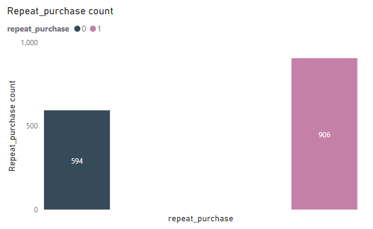

# Data Analyst Associate Practical Exam Submission

## Requirements
- Postgresql 15
- pgAdmin 4
- PowerBI

## Databases
ER Model


## Task 1

1. For every column in the data:
- State whether the values match the description given in the table above.
- State the number of missing values in the column.
- Describe what you did to make values match the description if they did not match.

**Product_id:** There were 1500 unique product identifier values. No values are missing.

**Category:** There were 6 unique category values. There were 25 null values '-'. Changes were made to the column; null values were replaced with 'Unknown'.
```
UPDATE pets_supplies
SET category = CASE
    WHEN category IS NULL OR category = '-' THEN 'Unknown'
    ELSE category
END;
```
**Animal:** There were 4 unique values matching the four values provided in the data dictionary. No values are missing, so no changes were made to the column.
```
SELECT COUNT(animal)
FROM pets_supplies
WHERE animal IS NULL OR category = 'NA' OR animal = '-';
```
```
SELECT COUNT(DISTINCT animal)
FROM pets_supplies;
```
**Size:** There were 3 unique values matching the three values provided in the data dictionary. No data is missing. The format of the column values was standardized, with the first letter in uppercase and the rest in lowercase.
```
SELECT COUNT(size)
FROM pets_supplies
WHERE size IS NULL or size = 'NA' OR size = '-';
```
```
UPDATE pets_supplies
SET size = CASE
    WHEN size IS NULL THEN 'Unknown'
    ELSE INITCAP(LOWER(size))
END;
```
**Price:** This column contained positive values, consistent with the description. 150 'Unlisted' data are missing. All missing values were replaced with the global mean. All column values were rounded to 2 decimal places.
```
SELECT COUNT(*)
FROM pets_supplies
WHERE price IS NULL OR price = 'unlisted';
```
```
UPDATE pets_supplies
SET price = (
    SELECT percentile_cont(0.5) WITHIN GROUP (ORDER BY CASE WHEN price = 'unlisted' THEN NULL ELSE price::numeric END)
    FROM pets_supplies
    WHERE price <> 'unlisted'
)
WHERE price = 'unlisted';
```
```
UPDATE pets_supplies
SET price = ROUND(price::numeric, 2)
WHERE price <> 'unlisted' AND price <> '';
```
**Sales:** This column contains positive values, consistent with the description. No values are missing. All column values were rounded to 2 decimal places.
```
SELECT COUNT(sales)
FROM pets_supplies
WHERE sales < 0 OR sales IS NULL;
```
```
UPDATE pets_supplies
SET sales = ROUND(sales::numeric, 2);
```
**Rating:** The values in this column ranged from 1 to 10, consistent with the description. 150 'NA' data are missing. All missing values were replaced with 0.
```
SELECT COUNT(rating)
FROM pets_supplies
WHERE rating IS NULL OR rating = 'NA';
```
```
UPDATE pets_supplies
SET rating = 
  CASE 
    WHEN rating IS NULL OR rating = 'NA' THEN 0
    ELSE rating::numeric
  END;
```
**Repeat_purchase:** The values in this column were either zero or one. No values are missing, but there were 142 negative values -0 and -1. All negative values were standardized to positive format.
```
SELECT COUNT(repeat_purchase)
FROM pets_supplies
WHERE repeat_purchase IS NULL OR repeat_purchase = '-0' OR repeat_purchase = '-1';
```
```
UPDATE pets_supplies
SET repeat_purchase = CASE 
    WHEN repeat_purchase = '-0' THEN '0'
    WHEN repeat_purchase = '-1' THEN '1'
    ELSE repeat_purchase
END;
```
## Task 2

2. Create a visualization that shows how many products are repeat purchases. Use the visualization to:
- State which category of the variable repeat purchases has the most observations.
- Explain whether the observations are balanced across categories of the variable repeat purchases.



A bar chart is an appropriate choice in this case because it effectively illustrates the imbalance in the data between repeat purchase (category 1) and non-repeat purchase (category 0). The graph clearly shows that category 1 has a count of 906 observations of customers who repeatedly buy the product and represents about 60.40% of the total observations, while there is a count of 594 observations of customers who do not repeatedly buy the product (category 0).

The observations are not balanced across the categories of the "repeat_purchase" variable, underscoring the need for attention to customer loyalty programs to encourage repeat purchases. 

## Task 3

3. Describe the distribution of all of the sales. Your answer must include a visualization that shows the distribution.


A bar chart is ideal for visualizing this information because it visually compares the sales figures of the different categories indicating that no category exceeds 35 million in sales, with "Equipment" being the highest selling category and "Unknown" the lowest selling category. It allows a quick assessment of relative sales performance and highlights that "Equipment" contributes significantly to total sales reaching a total of 34.8 million with 23.3%. It also underlines the need to investigate the "Unknown" category, which represents only 1.8% of sales, providing valuable information for possible product improvements.

The "Toys" category followed closely behind "Equipment", with total sales of 31.9 million. The "Food" category also performed well, with total sales of 28.7 million euros.

Sales in the "Medical", "Housing" and "Accessories" categories were 21.4 million, 17.5 million and 12.1 million, respectively.

## Task 4

4. Describe the relationship between repeat purchases and sales. Your answer must include a visualization to demonstrate the relationship.


A scatter plot is the preferred option in this case because it effectively visualizes the positive correlation between repeat purchases and sales, given that both variables are continuous. 

In the "Accessories" category, which recorded a high number of 126 repeat purchases, significant sales were also recorded, amounting to 12.1 million in monetary sales. This indicates a positive correlation, as a higher number of repeat purchases is associated with higher sales.

Similarly, in the "Equipment" category, which recorded the highest number of 370 repeat purchases, significant sales were observed, amounting to 34.8 million in monetary sales. This reinforces the positive correlation between repeat purchases and sales.

The "Toys" category also shows this trend, with a high number of 255 repeat purchases and sales amounting to 31.9 million in monetary sales.

Other categories such as "Food", "Housing", "Medicines" and "Unknown" also show a positive correlation between repeat purchases and sales, as categories with a higher number of repeat purchases tend to have higher sales.

Given the positive correlation observed, it is recommended that the team should
Implement or improve customer loyalty programs to encourage more repeat purchases. 
Engage with customers after purchase through feedback surveys, personalized recommendations and targeted marketing campaigns. This can help you understand their preferences and ensure they buy again.

## Technology Stack
- Postgresql 15
- PowerBI
